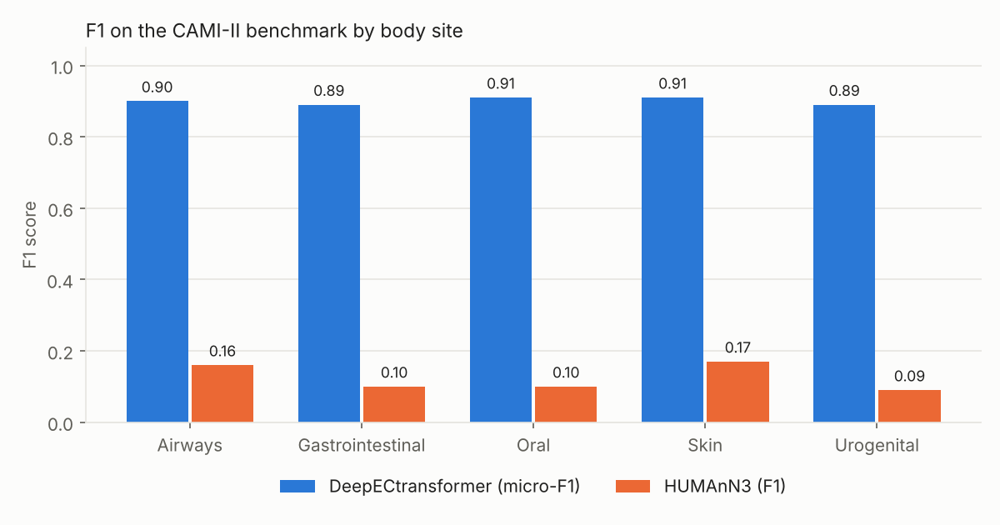
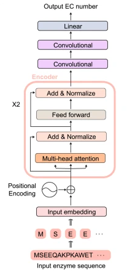
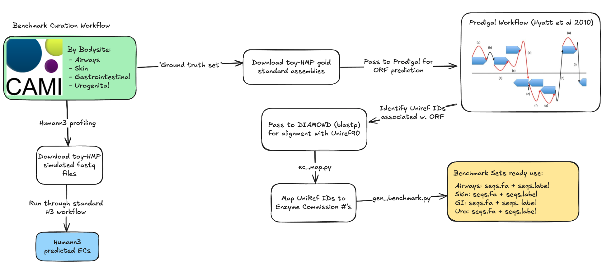

# Metagenomic Functional Profiling

**Benchmarking a transformer-based enzyme classifier (DeepECtransformer) against alignment-based and machine-learning methods for annotating enzyme functions in metagenomes.**

**Authors:** Anisha Gollapalli, Jonathan Turck, Jen Li Kao

<p align="center">
  
</p>

---

## Table of contents

1. [Overview](#overview)
2. [Goals](#goals)
3. [Methods compared](#methods-compared)
4. [Datasets](#datasets)
5. [Experiments](#experiments)
6. [Results](#results)
7. [Reproducing a 2023 model on modern hardware](#reproducing-a-2023-model-on-modern-hardware)
8. [Insights](#insights)
9. [Getting started](#getting-started)
10. [Repository structure](#repository-structure)

---

## Overview

Functional profiling asks what a microbial community can *do*, by assigning Enzyme Commission (EC) numbers to its genes. The standard tools are alignment-based: they match genes against reference databases, which is precise but leaves divergent or novel genes unannotated.

Transformer models learn context across the whole amino-acid sequence and may annotate genes that alignment misses. Their real-world reliability on full metagenomes, however, has rarely been benchmarked. This project builds a gold-standard benchmark from simulated metagenomes and tests **DeepECtransformer** against **HUMAnN3**, **Carnelian**, and **ECPICK**.

**Key outcomes**

- Curated a benchmark of **251,559** high-confidence EC-labeled sequences from five human body sites ([Zenodo](https://doi.org/10.5281/zenodo.15192200))
- DeepECtransformer reached **micro-F1 ≥ 0.89** on the validation set and every benchmark site, annotating over 95 % of ORFs
- HUMAnN3 averaged **F1 ≈ 0.12** on the same benchmark (high sensitivity, low precision)
- Macro-F1 was up to 24 points lower than micro-F1, revealing weaker performance on **rare enzyme classes**
- Swapping in the **ProtT5** encoder narrowed the micro–macro gap to about 10–13 points

---

## Goals

| # | Question | Approach |
| --- | --- | --- |
| 1 | How accurate is DeepECtransformer on curated proteins? | Evaluate on the Carnelian validation set |
| 2 | Does it hold up on realistic metagenomes? | Build a CAMI-II benchmark and compare with HUMAnN3 |
| 3 | Why does it miss some enzymes? | Sequence-similarity analysis of misclassified proteins |
| 4 | Can a stronger encoder help? | Retrain with ProtT5 and compare with a CNN baseline (ECPICK) |

---

## Methods compared

| Method | Approach | Notes |
| --- | --- | --- |
| **HUMAnN3** | Alignment to pangenomes and UniRef protein clusters | Current gold standard; precise but computationally heavy and blind to divergent genes |
| **Carnelian** | k-mer profiles with one-vs-all classifiers | Lighter than alignment; lower precision |
| **DeepECtransformer** | Two transformer encoders (ProtBERT), two convolutional layers, and a linear output, plus a homology fallback | Trained on 22 million enzymes covering 2,802 EC numbers (5,360 with homology search) |
| **ECPICK** | Convolutional network with hierarchical EC-level layers | Contemporary deep-learning baseline |

<p align="center">
  
  <br>
  <em>DeepECtransformer architecture.</em>
</p>

---

## Datasets

**Validation set.** 7,884 prokaryotic proteins with EC labels, the same set used to evaluate Carnelian ([`Validation dataset/`](Validation%20dataset)).

**Benchmark set.** CAMI-II provides simulated metagenomes with ground-truth genomes but no functional labels, so we built the EC labels ourselves:

1. Gold-standard assemblies from the CAMI-II toy Human Microbiome Project (airways, gastrointestinal, oral, skin, urogenital).
2. Gene prediction with **Prodigal v2.6.3** (single-genome mode).
3. Homology search against **UniRef90 (2021.03)** with **DIAMOND v2.1.9**, keeping the top hit.
4. High-confidence filtering: identity ≥ 90 %, query and subject coverage ≥ 80 %.
5. Mapping UniRef90 clusters to EC numbers with the HUMAnN3 utility database.

<p align="center">
  
  <br>
  <em>Benchmark curation workflow.</em>
</p>

<div align="center">
<table>
  <tr>
    <th>Predicted ORFs</th>
    <th>EC-labeled sequences</th>
  </tr>
  <tr>
    <td align="center"></td>
    <td align="center"></td>
  </tr>
  <tr>
    <th colspan="2">Unique EC numbers</th>
  </tr>
  <tr>
    <td colspan="2" align="center"></td>
  </tr>
</table>
</div>

In total the benchmark contains **251,559** EC-labeled sequences covering **2,392** unique EC numbers.

The benchmark is available on Zenodo: [](https://doi.org/10.5281/zenodo.15192200)

---

## Experiments

1. **Baseline.** Run the pretrained DeepECtransformer (ProtBERT encoder) on the validation set and all five benchmark sites; score predictions with micro- and macro-averaged precision, recall, and F1.
2. **HUMAnN3 baseline.** Run HUMAnN3 v3.9 on the matching CAMI-II reads, map gene families to EC numbers, and apply standard thresholds (CPM ≥ 1, per-sample fraction ≥ 0.20).
3. **Similarity analysis.** Compare each misclassified protein with all correctly classified ones using 3-mer Jaccard similarity.
4. **Encoder replacement.** Retrain DeepECtransformer from scratch with **ProtT5** in place of ProtBERT, using the original UniProt training data and filtering.
5. **CNN comparison.** Evaluate **ECPICK** on the same datasets.

Micro-averaged scores reflect performance on common classes; macro-averaged scores weight every EC class equally and expose weaknesses on rare ones.

---

## Results

### F1 by dataset

| Dataset | ProtBERT micro | ProtBERT macro | ProtT5 micro | ProtT5 macro | ECPICK micro | ECPICK macro | HUMAnN3 |
| --- | --- | --- | --- | --- | --- | --- | --- |
| Validation | **0.91** | **0.81** | 0.71 | 0.76 | 0.81 | 0.75 | — |
| Airways | **0.90** | 0.69 | 0.73 | 0.64 | 0.64 | 0.52 | 0.16 |
| Gastrointestinal | **0.89** | 0.79 | 0.80 | 0.71 | 0.71 | 0.58 | 0.10 |
| Oral | **0.91** | 0.73 | 0.80 | 0.61 | 0.76 | 0.53 | 0.10 |
| Skin | **0.91** | 0.67 | 0.80 | 0.61 | 0.68 | 0.54 | 0.17 |
| Urogenital | **0.89** | 0.78 | 0.82 | 0.68 | 0.73 | 0.60 | 0.09 |

- **DeepECtransformer (ProtBERT)** is the most accurate method on every dataset.
- **HUMAnN3** recovers most true enzymes (mean sensitivity 0.91) but with very low precision (mean 0.07). It also needed about 19 CPU-hours per sample. It starts from raw reads rather than predicted ORFs, so its costs are not directly comparable.
- **ProtT5** lowers peak accuracy but makes micro and macro scores more balanced across classes.
- **ECPICK** is easy to install but left 915 of 7,884 validation proteins unannotated, compared with 3 for DeepECtransformer.

### Why rare enzymes are missed

Misclassified proteins share little sequence with correctly classified ones: average 3-mer Jaccard similarity is 0.03–0.04, and the average maximum similarity is at most 0.20 on every dataset. In the oral set, over 84 % of misclassified proteins have a maximum similarity below 0.2. The model performs well on familiar sequence patterns but generalizes poorly to atypical ones, consistent with the long-tailed distribution of EC classes in its training data.

---

## Reproducing a 2023 model on modern hardware

DeepECtransformer was released with Python 3.6, CUDA 10.2, and Transformers 3.5.1, which no longer run on Google Colab or current clusters. We rebuilt the environment on the Texas A&M **Grace** HPC cluster:

| Component | Original | Ours |
| --- | --- | --- |
| Python | 3.6 | 3.8 |
| CUDA | 10.2 | 11.3.1 |
| Transformers | 3.5.1 | 4.2.2 |
| PyTorch | 1.7.0 | 1.12.1 |

Upgrading the Transformers library changed model behavior, so we restored the original configuration manually: we set the attention implementation and gradient-checkpointing attributes, and zeroed and froze the positional embeddings that newer versions add by default. Tokenizer files were downloaded in advance because the cluster has no internet access. The model then ran correctly on both CPU and GPU.

---

## Insights

- **Transformers can complement alignment.** On well-characterized enzymes, DeepECtransformer is far more precise than HUMAnN3 at a fraction of the compute.
- **Micro scores hide the long tail.** Reporting macro metrics was essential to see the weakness on rare EC classes.
- **The encoder shapes the trade-off.** ProtT5 traded peak accuracy for more even performance across classes.
- **Benchmark construction matters.** Labels derived from alignment may favor alignment-based tools, and unaligned ORFs remain an open test set for discovering novel enzyme functions.

---

## Getting started

The model code in [`Model/`](Model) is adapted from the original [DeepECtransformer (DeepProZyme)](https://github.com/kaistsystemsbiology/DeepProZyme) repository.

```bash
cd Model
conda env create -f environment.yml
conda activate deepectransformer

# CPU
python run_deepectransformer.py -i input.fa -o ./results -g cpu -b 128 -cpu 2
# GPU
python run_deepectransformer.py -i input.fa -o ./results -g cuda:0 -b 128 -cpu 2
```

Inputs are protein sequences in FASTA format; outputs are predicted EC numbers. The benchmark sequences and labels can be downloaded from [Zenodo](https://doi.org/10.5281/zenodo.15192200).

---

## Repository structure

```
.
├── Model/                    # DeepECtransformer code, environment files, and tokenizer
├── Validation dataset/       # Validation proteins (seq.fasta) and EC labels (seq.label)
├── benchmark_curation/       # Benchmark construction scripts, logs, and summary plots
├── Results/
│   ├── result_val/           # Predictions and F1 scores on the validation set
│   └── result_benchmark/     # Predictions and F1 scores for each body site (CPU and GPU runs)
├── images/                   # README figures
└── DeepECtransformer_Benchmarking_AGJTJLK_ecen766-finalProjectSpr2025.pdf   # Full report
```
